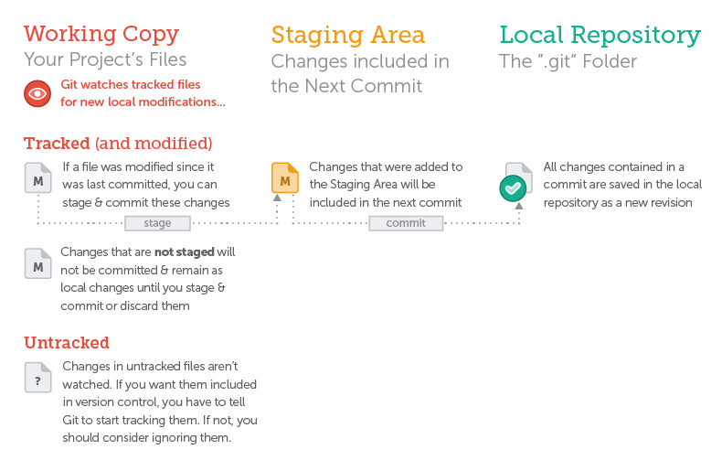

# Git

- vcs is kind of a db that store your snapshot of your project at given point of time
- vcs is independent of a tech stack

## BASIC

### why to use vcs

- collaboration
- storing version properly
  - problem :
    - what to save ?
    - naming ?
    - how to find difference
- restoring prev. version of your code
- distributed vcs is also acts as backups

- you can use git in both way cli(command line interface) or gui(graphical user interface) but at learning time of git cli is recommended.

### installing a git :

[download git for windows](https://git-scm.com/downloads)

### configuring git :

`git config --global user.name "Jay Bhogayata"` set username

`git config --global user.email "jaybhogayata53@gmail.com"` set email

`git config --global color.ui auto`

### basic workflow

- A Git repository is the .git/ folder inside a project. This repository tracks all changes made to files in your project, building a history over time. Meaning, if you delete the .git/ folder, then you delete your project’s history.

- commit : A commit is a wrapper for a specific set of changes with message

- before commit check status : which files is changed by you

- A "local" repository resides on your local computer, as a ".git" folder inside your project's root folder.

- A "remote" repository, in contrast, is typically located on a remote server on the internet or in your local network. (github, bitbucket , gitlab etc..)

- `git init` : git start versioning this project
- `ls -la` : **empty** repo `.git` when you init the git it can to add your files under vcs you have to tell git to do it.
- `git add .` (. all or you can give any specific file like index.html)
- `git commit -m "initial commit"`
- `.gitignore` : file or dir you want to ignore [good collection of .gitignore](https://github.com/github/gitignore)


- cloning a remote repo

```
git clone repo_URL
```

- status of file in a git :
  - tracked : file under vcs
  - untracked : file that are not under vcs



- for overview `git status`

- `git add index.html`
- `git rm --cached index.html`

- If you have a longer commit message, possibly with multiple paragraphs, you can leave out the "-m" parameter and Git will open an editor application for you

- `git commit -m "initial commit"` if you want to write message on editor then you can skip `-m` flag.

- inspecting the commit history

  ```
  git log
  ```

  - for new page **space** for quit **q**

  - every commit have
    - commit hash (40 ch. sha checksum) for data integrity
    - author name and email
    - date
    - commit message
  - Git also allows you to display the detailed changes that happened in each commit. `git log -p`

## Branching and Merging

- solve the problem for different context
- **All the changes you make at any time will only apply to the currently active branch; all other branches are left untouched.**
- to check your are on which branch use `git status`
  or you can use `git branch` also this will add `*` before your current branch. use if `git brach -v` for verbose(more info)

- create the branch

```
git branch brachName
```

#### stash

- save changes temporarily (git stash)
- Think of the Stash as a clipboard on steroids: it takes all the changes in your working copy and saves them for you on a new clipboard
- `git stash` : save the stash
- `git stash list`
- `git stash pop` will apply the newest Stash and clear it from your Stash clipboard.
- `git stash apply nameOfStash` will also apply the specified Stash, but it will remain saved.
- `git stash drop stashName"` del stash
- When to Stash : Stashing helps you get a clean working copy. While this can be helpful in many situations, it's strongly recommended...
  - before checking out a different branch.
  - before pulling remote changes.
  - before merging or rebasing a branch.

`git commit -am "bug fix #154289"` = git add . + git commit -m "msg"

- go to new branch `git checkout brachName`
- what is HEAD : You can think of the HEAD as the "current branch". When you switch branches with git checkout, the HEAD revision changes to point to the tip of the new branch.

- at the end you have to merge

- In Git, performing a merge is easy as pie. It requires just two steps:

  1. Check out the branch that should receive the changes.
  2. Call the "git merge" command with the name of the branch that contains the desired changes

- `git merge branchName`

- In some situations, merging will result in one or more "merge conflicts". In such a case, Git wasn't able to combine changes, e.g. because the exact same line was modified in two different ways. You'll then have to decide yourself which content you want.

- Good workflow
  - single log running branch (production code)
  - for a new feature or bugfix new branch
  - keep remote in sync
  - push often

## Remote Repo

- sharing data with your teammates, a remote repo comes into play. Think of it like a "file server" that you use to exchange data with your colleagues.


- adding remote url
- `git remote add origin https://github.com/jay-bhogayata/gitExplore.git`
- list `git remote -v`
  - fetch url : read access
  - push url : write access 

- Remote Data is a Snapshot
  - Git stores information about remote data (like branches, commits, etc.) in your local repository for you. However, there is no "live" connection to your remote. E.g. you will not automatically see new commits or branches that your teammates published on a remote - because you have to explicitly tell Git to update!

  - The information about remote branches, remote commits, etc. is only as fresh as the last snapshot that you requested. There is no "automatic" update in the background.

- to fetch info from remote `git fetch origin`

- rename brach `git branch -M newName`

- `git brach -va`

- --track 

- push to remote `git push -u origin main`  origin : name of brach main:name of remote branch
- The -u option does the following: For every branch that is up to date or successfully pushed, add an upstream (tracking) reference, used by argument-less, git-pull and other commands.So, after pushing your local branch with the -u option, this local branch will be automatically linked with the remote branch, and you can use git pull without any arguments.

- `git fetch origin`
- `git log origin/main`

- `git pull` = fetch + merge

- A local branch that you create on your machine is kept private to you until you explicitly decide to publish it. This means that it's perfectly possible to keep some of your work private while sharing only certain other branches with the world.

- del the branch `git branch -d nameOfBranch`
- we also delete the remote branch by using the "git push" command with the "--delete" flag:
- `git push origin --delete nameOfRemoteBranch`

# THE GOLDEN RULES OF VERSION CONTROL

- Commit Only Related Changes.
- Write Good Commit Messages.
- Use Branches Extensively
- Never Commit Half-Done Work
